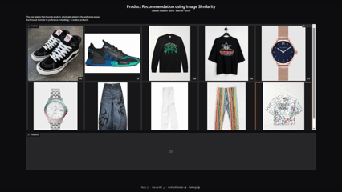

# Recommendation using Image Similarity

Image-based product recommendation using visual embeddings and semantic similarity search. The user selects products they like; the system learns their preference and surfaces visually similar items in real time.

## How it Works

Images are encoded into 768-dimensional vectors using **SigLIP2**. Similarity search runs via **FAISS** (IndexFlatIP = cosine similarity over normalized embeddings). Each round: 5 items retrieved by similarity to the user's preference embedding (running average of selections) + 5 random items across all categories. No item is shown twice.

## Dataset

520 product images — sneakers, pants, watches, t-shirts (~130 each).  
Sneakers are further split by model; other categories are flat.  

## Evaluation

Online Precision@5 per click, plotted with matplotlib at end of session.

## Stack

`transformers` · `faiss-cpu` · `gradio` · `torch` · `Pillow` · `pandas`

## Reference

Inspired by [Tony Assi's product recommendation demo](https://github.com/tonyassi/fashion-recommendation).  

and   

[Hugging Face — Image Similarity Notebook](https://colab.research.google.com/github/huggingface/notebooks/blob/main/examples/image_similarity.ipynb)
